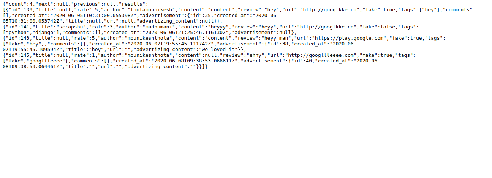
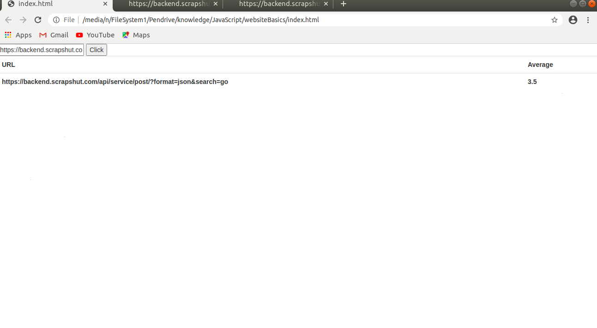

# Get-and-Post-jSON-data-from-URL-using-jQuery-Ajax

Obtained Data :

On Click of Button :

 
1. Provide the Valid Url.
 
2. Click the Button. 
 
3. Display the Results.
 

Get the data from the url and post it on HTML page using jQery Ajax.

<b> Done. </b> 
